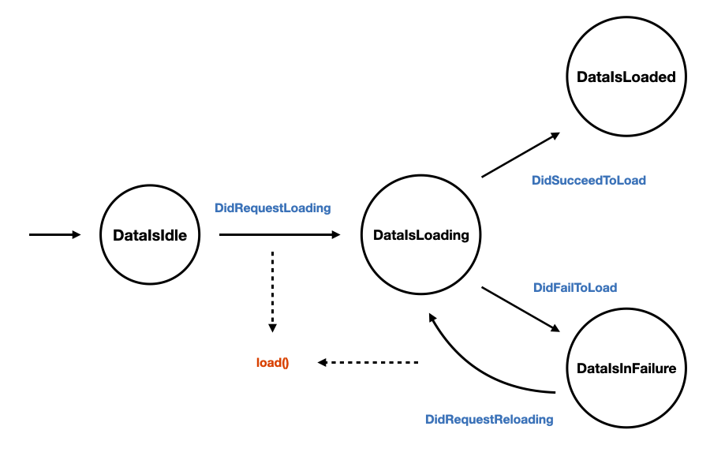

# StateMachine

`StateMachine` aims to provide a way to structure an application thanks to state machines. The goal is to identify the states and the side effects involved in each feature and to model them in a consistent and scalable way thanks to a DSL.

## Installation

```swift
let package = Package(
  name: "Example",
  dependencies: [
    .package(name: "StateMachine", path: "../StateMachine")
  ],
  targets: [
    .target(name: "Example", dependencies: [.product(name: "StateMachine", package: "StateMachine")])
  ]
)
```

## Key points
- Each feature is a [Mealy state machine](https://en.wikipedia.org/wiki/Mealy_machine)
- State machines are declarative: a DSL offers a natural and concise syntax
- Swift concurrency is at the core:
	- A state machine is an `AsyncSequence`
	- Each side effect runs inside a `Task` that benefits from cooperative cancellation
- Dependencies are injected per side effect: no global bag of dependencies
- State machines are not UI related: it works with UIKit or SwiftUI

## Runtime semantics

Import the product that your feature needs. `StateMachineCore` contains the
DSL and runtime; `StateMachineBroadcast`, `StateMachineDump`, and
`StateMachineTest` are optional companion products. The `StateMachine` product
continues to expose the complete bundle for existing integrations.

```swift
import StateMachineCore
```

`AsyncStateMachine` executes commands independently from state observation.
You may send events before creating an iterator; the initial and committed
states are buffered for the single observer. Iteration is unicast and only
controls observation, not transition execution or output cancellation.

```swift
machine.send(event: DidRequestLoading(id: "42"))

// Wait for the output, preserving the original behavior.
await machine.sendAndWait(event: DidRequestLoading(id: "42"))

// Or wait only until the state transition is committed.
await machine.sendAndWait(
  event: DidRequestLoading(id: "42"),
  until: .transitionCommitted
)

// Stop accepting new events. This waits until supervised outputs have exited.
await machine.finishAndWait()
```

Outputs may return an erased event stream or a concrete stream whose element
conforms to `Event`; concrete values are erased by the runtime:

```swift
Output {
  AsyncStream<DidSucceedToLoad> { continuation in
    continuation.yield(DidSucceedToLoad(data: data))
    continuation.finish()
  }
}
```

Lifecycle callbacks are delivered in lifecycle order (`initialState`, then
transitions). Handlers registered for the same lifecycle event may run
concurrently. `finish()` drains already accepted commands before terminal
shutdown; `finishAndWait()` is the explicit completion barrier.

Cancelling a `sendAndWait` caller stops only that caller's wait. Once accepted,
the command remains ordered in the machine and continues under normal output
supervision.

## Contribution
Contributions are always welcome. To ensure conformance to our [style guidelines](https://touchtunes.atlassian.net/wiki/spaces/PROJECTS/pages/31686967/iOS+Guidelines) and prevent breaking modifications, the project uses specific tooling in the form of linting and formatting tools, as well as git hooks.

Before contributing, please make sure you have run the configuration script to install them.

If this is not possible at the moment, please follow the below instructions:
1. Install the latest version of [SwiftLint](https://github.com/realm/SwiftLint)
2. Install the latest version of [SwiftFormat](https://github.com/nicklockwood/SwiftFormat)
3. Check out the project, open a terminal at the root of the folder and run the following:
```bash
./scripts/installGitHooks.sh
```
This script will install the relevant git hooks to make sure that:
- the code is properly formatted pre-commit
- all unit tests pass before modifications can be pushed

⚠️ **The final step will need to be repeated if you ever delete the `.git` repo from your local folder, or your local folder altogether.**

# State Machines

A state machine is defined by:

- a set of possible states
- a set of possible events
- an initial state
- some transitions driving the passage from on state the another given an event
- some outputs that are executed depending on the current state and an event

Here is a diagram describing a simple state machine:



### How does it read?

- **INITIALLY**, the `data is idle`, the feature does nothing.
- **WHEN** the `data is idle`, **ON** the event `did request loading`, the `data is loading` and the `load()` output is executed.
- **WHEN** the `data is loading`, **ON** the event `did succeed to load`, the `data is loaded`.
- **WHEN** the `data is loading`, **ON** the event `did fail to load`, the `data is in failure`.
- **WHEN** the `data is in failure`, **ON** the event `did request reloading`, the `data is loading` and the `load()` output is executed.

### What defines this state machine?

- The feature can be in 4 exclusive **states**: `DataIsIdle`, `DataIsLoading`, `DataIsLoaded` and `DataIsInFailure`. _This is the finite set of possible **states**_. The initial state of the feature is 
`DataIsIdle`.
- The feature can receive 4 **events**: `DidRequestLoading`, `DidSucceedToLoad`, `DidFailToLoad` and `DidRequestReloading`. _This is the finite set of possible **events**._
- The feature can perform 1 **action**: `load()`. _This is the finite set of possible **outputs**._
- The elevator can go from one state to another when events are received. _This is the finite set of possible **transitions**._

The assumption we make is that almost any feature can be described in terms of state machines. And to make it as simple as possible, we use a Domain Specific Language.

You can read the naming convention for states and events [here](https://touchtunes.atlassian.net/wiki/spaces/PROJECTS/pages/35487815/Naming+conventions).

# DSL

## How to model the states

States is a finite set of possible values. Each state conforms to the `State` protocol which only requirement is to provide a
`SuperState` property.

The `SuperState` property serves two purposes:

- we use its type as a unique identifier that identifies the set of states (`SuperState` is used as a generic contraint in the implementation, all the states of the feature are 
constrained by this `SuperState`. This is how we model the concept of set)
- it represents the aggregate of values that the user of the state machine cares about (it allows to derive those values directly from each individual state, there is no need for a 
`switch` statement that we would need if we used `enums` - which could go against the O/C principle).

```swift
struct FeatureState: Equatable {
  let isLoaded: Bool
  let isError: Bool
}

struct DataIsIdle: State {
  var superState: FeatureState {
    FeatureState(isLoaded: false, isError: false)
  }
}

struct DataIsLoading: State {
  let id: String
  var superState: FeatureState {
    FeatureState(isLoaded: false, isError: false)
  }
}

struct DataIsLoaded: State {
  let data: Data
  var superState: FeatureState {
    FeatureState(isLoaded: true, isError: false)
  }
}

struct DataIsInFailure: State {
  let id: String
  let error: Error
  var superState: FeatureState {
    FeatureState(isLoaded: false, isError: true)
  }
}
```

## How to model the events 

Events is a finite set of possible values. Each event conforms to the `Event` protocol which only requirement is to provide a
`SuperEvent` associated type.

We use its type as a unique identifier for the set of events (`SuperEvent` is also used as a generic contraint in the implementation).

```swift
enum FeatureEvent {}

struct DidRequestLoading: Event {
  typealias SuperEvent = FeatureEvent
  let id: String
}

struct DidRequestReloading: Event {
  typealias SuperEvent = FeatureEvent
}

struct DidSucceedToLoad: Event {
  typealias SuperEvent = FeatureEvent
  let data: Data
}

struct DidFailToLoad: Event {
  typealias SuperEvent = FeatureEvent
  let error: Error
}
```

## How to model the state machine 

```swift
let stateMachine = StateMachine<FeatureState, FeatureEvent>(initial: DataIsIdle()) {
  When(states: 
    DataIsIdle.self,
    DataIsLoaded.self
  ) {
    On(event: DidRequestLoading.self) { _, event in
      Transition(state: DataIsLoading(id: event.id))
      Output(sideEffect: load(event.id), cancellationPolicy: Cancel(on: DidRequestLoading.self)) // sets the cancellation policy
    }
  }

  When(state: DataIsLoading.self) {
    On(event: DidSucceedToLoad.self) { _, event in
      Transition(state: DataIsLoaded(data: event.data))
    }

    On(event: DidFailToLoad.self) { _, event in
      Transition(state: DataIsInFailure(error: event.error))
    }
  }
  
  When(state: DataIsInFailure.self) {
    On(event: DidRequestReloading.self) { state, event in
      Transition(state: DataIsLoading(id: state.id)
      Output(priority: .high, sideEffect: load(state.id)) // it is possible to specify the execution priority
        .cancellationPolicy(cancel: Cancel(whenNewState: DataIsLoaded.self)) // sets the cancellation policy with a "modifier" style
    }
  }
}
```

## Output lifecycle policy (restart / supervision)

Outputs can return a single event (or nil) or an AsyncSequence of events. You can use `lifecyclePolicy` to restart a side effect
when it finishes or fails, and map failures into events with `onFailure`.

```swift
let stateMachine = StateMachine<FeatureState, FeatureEvent>(initial: DataIsIdle()) {
  When(state: DataIsIdle.self) {
    On(event: DidRequestLoading.self) { _, event in
      Transition(state: DataIsLoading(id: event.id))
      Output(
        sideEffect: load(event.id),
        lifecyclePolicy: .restartOnFailure(maxRestarts: 3),
        onFailure: { error in DidFailToLoad(error: error) }
      )
    }
  }
}
```

# How to run a state machine

As mentioned, a state machine is an `AsyncSequence` of states. Once we have described it thanks to the DSL, we can use it to instantiate an `AsyncStateMachine`.

```swift
let stateMachine = AsyncStateMachine(stateMachine: stateMachine)

for await state in stateMachine {
  ...
}
```

We can register callbacks that will be called on several events in the state machine's lifecycle:

```swift
let stateMachine = AsyncStateMachine(stateMachine: stateMachine)
  .onInitialState { id, state in
      print("[id: \(id)]: initial state \(state)") // or do analytics
  }
  .onTransition { id, currentState, event, newState in
    print("[id: \(id)]: \(currentState) + \(event) = \(newState)") // or do analytics
  }
  .onDeinit { id in
    print("[id: \(id)]: was deinit) // or do analytics
  }
}
```

It is also possible to instantiate the `AsyncStateMachine` directly with an initial state and the DSL:

```swift
let asyncStateMachine = AsyncStateMachine<FeatureState, FeatureEvent>(initial: DataIsIdle()) {
  When(state: DataIsLoading.self) {
    On(event: DidSucceedToLoad.self) { state, event in
      ...
    }

    On(event: DidFailToLoad.self) { state, event in
      ...
    }
  }
}
```

# How to send events to the state machine

```swift
asyncStateMachine.send(event: DidRequestLoading(id: 1701))

// or in a suspending/resuming way:

await asyncStateMachine.sendAndWait(event: DidRequestLoading(id: 1701)) // in this case the function will resume when the associated output is done (if any)
```

# How to run a state machine in the context of a UI

```swift
let asyncStateMachine = AsyncStateMachine(initial: DataIsIdle()) {
  ...
}
```

From there, there are two ways to proceed:

## StateMachineView

We can use a `StateMachineView` within our view hierarchy to wrap an `AsyncStateMachine` and then use the `UIStateMachine` that is
given back to us to interact with the state machine. It involves being able to provide an `AsyncStateMachineFactory` that knows how to
build our `AsyncStateMachine`. We can use the `@Environment` mechanism to inject the factory in the view.

```swift
// at an app level
let asyncStateMachineFactory = AsyncStateMachineFactory {
  ...
  return makeAsyncStateMachine(initial: DataIsIdle(), load: concreteLoadOutput)
}

@main
struct SampleApp: App {
  var body: some Scene {
    WindowGroup {
      ContentView()
        .environment(\.stateMachineFactory, asyncStateMachineFactory)
    }
  }
}

struct ContentView: View {
  @Environment(\.stateMachineFactory) private var stateMachineFactory
  
  var body: some View {
    StateMachineView(factory: stateMachineFactory) { uiStateMachine in
      Text("\(uiStateMachine.state.name)")
    }
  }
}
```

Under the hood, `uiStateMachine` (as it is an `ObservableObject`) is managed by a `@StateObject`.
Every time the state is updated, the `@StateObject` triggers a refresh of the view hierarchy.

## UIStateMachine

We can also instantiate a `UIStateMachine` by ourselves:

```swift
// at the app level
let asyncStateMachine = makeAsyncStateMachine(initial: DataIsIdle(), load: concreteLoadOutput)
let uiStateMachine = UIStateMachine(asyncStateMachine: asyncStateMachine)
let myView = MyView(uiStateMachine: uiStateMachine)

struct MyView: View {
  @ObservableObject var uiStateMachine: UIStateMachine<SuperState, SuperEvent>
  
  var body -> some View {
    VStack {
      Text("\(self.uiStateMachine.state.isLoaded)")
      Button("Load) {
        self.uiStateMachine.send(DidRequestLoading(id: 2))
      }
    }
    .task {
      self.uiStateMachine.start()
    }
  }
}
```

## Instantiation strategy

There are usecases where we need a state machine to be shared across several views. By default an `AsyncStateMachineFactory`
will create a new instance of an `AsyncStateMachine` everytime it is executed. It means that if such an `AsyncStateMachineFactory`
is injected into 2 views, there will be 2 distinct instances of `AsyncStateMachine` created with completely separated
runtimes.

When we want the views to share the same state machine (to avoid executing side effects multiple times for instance), we can
set a `lifecycle` in the `AsyncStateMachineFactory` constructor:

```swift
let asyncStateMachineFactory = AsyncStateMachineFactory(lifecycle: .singleton) {
  ...
}
```

Whenever the state is mutated, all the views will be updated and all the views can use the state machine concurrently.

## UIState

If we need to create a `UIState` from the `SuperState` because we want extra transformation before rendering, we can use a mapping function.

```swift
struct UIState: Equatable {
  let description: String
}

let toUIState: (SuperState) -> UIState = { superState in
  UIState(description: "\(superState.isLoaded)")
}

StateMachineView(factory: asyncStateMachineFactory, mapping: toUIState) { uiStateMachine in
  ...
}

// or

let uiStateMachine = UIStateMachine(asyncStateMachine: asyncStateMachine, mapping: toUIState)
```

The state machine will now expose a `UIState` to the view.

## How to derive a `Binding` from the state machine

```swift 
self
  .stateMachine
  .binding(\.isLoaded, send: DidRequestLoading(id: 4))
```

This will create a `Binding` that reads the `isLoaded` property from the state and sends the `DidRequestLoading` event every time the
wrapped value ie mutated.

# How to dump the state machine's state

It is possible to track the lifecycle of several state machines and dump their current states under any format
you'd like:

```swift
StateMachineDump.startCollecting() // enable the dump for every tracked state machine
asyncStateMachine.activateDump() // will track: initial state, subsequent transitions, deinit
StateMachineDump.dump { stateContexts in
  // here we can access all the states that are currently "alive"
  // we can export the data into a JSON file and store it for instance
}
StateMachineDump.stopCollecting() // disable the dump for every tracked state machine
```

# How to customize the logging

By default the sequence will log every transition (current state + event => new state) using the Apple unified logging system. You can change
that by setting your own logging function:

```swift
StateMachine.setLogger { title, currentState, event, newState in
  let currentStateStr = String(describing: currentState)
  let eventStr = String(describing: event)
  let newStateStr = String(describing: newState)
  print("[\(title)] \(currentStateStr) + \(eventStr) -> \(newStateStr)")
}
```

# How to connect state machines together

```swift
let stateMachine1 = AsyncStateMachine(initial: DataIsIdle1()) {
  ...
}

let stateMachine2 = AsyncStateMachine(initial: DataIsIdle2()) {
  ...
}

let mediator = Mediator<SuperState1, SuperEvent1>()

stateMachine1.connectAsReceiver(to: mediator)
stateMachine2.connectAsSender(to: mediator, whenCurrentState: DataIsIdle2.self, on: DidRequestLoading2.self) { state, event in
  DidRequestLoading()
}
```

In this case, when the second state machine will operate the transition `DataIsIdle2 + DidRequestLoading2`, an event `DidRequestLoading`
will be sent to the first state machine. There are other variations of the `connectAsSender` function.

# Composite state machines (two-child prototype)

You can compose **two child state machines** inside a parent state using the `Composite` DSL. The composite is active only while the parent
is in the owning state, and you can route events between parent and children and define a join rule.

```swift
StateMachine<RootState, RootEvent>(initial: RootIdle()) {
  When(state: RootRunning.self) {
    Composite {
      StateMachine<AuthState, AuthEvent>(id: AuthMachine.self, initial: AuthIdle()) {
        // child auth transitions
      }

      StateMachine<SyncState, SyncEvent>(id: SyncMachine.self, initial: SyncIdle()) {
        // child sync transitions
      }
    }
    .on(parentEvent: RootCancellationWasRequested.self) { _, _ in
      Forward(to: AuthMachine.self, event: AuthCancel())
      Forward(to: SyncMachine.self, event: SyncCancel())
    }
    .on(childEvent: AuthEvent.Success.self) { _, event in
      Raise(event: RootEvent.auth(event))
    }
    .on(childEvent: SyncEvent.Success.self) { _, event in
      Raise(event: RootEvent.sync(event))
    }
    .join(whenChildStates: AuthFinished.self, SyncFinished.self) {
      Raise(event: RootWasSuccessful())
    }
  }
}
```

Notes:
- Child state machines must use `StateMachine(id:initial:)` so they can be addressed by `Forward`.
- `Composite` must be used inside a `When(state: ...)` with a single state.
- The join rule is ordered by the two child declarations and fires once per composite activation.

# How to test

To assert that the state machine will emit the expected states given a list of events:

```swift
let expectedState1 = DataIsIdle()
let expectedState2 = DataIsLoading()
let expectedState3 = DataIsLoaded(value: 1701)
    
let asyncStateMachine = AsyncStateMachine<FeatureState, FeatureEvent>(initial: expectedState1) {
  When(state: DataIsIdle.self) {
    On(event: DidRequestLoading.self) { _, _ in
      Transition { expectedState2 }
      Output { DidSucceedToLoad(value: 1701) }
    }
  }

  When(state: DataIsLoading.self) {
    On(event: DidSucceedToLoad.self) { _, _ in
      Transition(state: expectedState3)
    }
  }

  When(state: DataIsLoaded.self) {
    On(event: DidRequestReloading.self) { _, _ in
      Transition(state: expectedState2)
    }
  }
}

await XCTAssert(asyncStateMachine: asyncStateMachine) { assertions in
  await assertions.assert(state: expectedState1)
  
  assertions.send(DidRequestLoading(id: 1701))
  await assertions.assert(state: expectedState2)
  await assertions.assert(state: expectedState3)
  
  assertions.send(DidRequestReloading(id: 1701))
  await assertions.assert(state: expectedState2)
  await assertions.assert(state: expectedState3)
  
  assertions.send(DidRequestLoading(id: 1701))
  await assertions.assertNoTransition()
}
```

It ensures that the state machine behaves as expected from a complete user flow perspective.
It is a holistic way of testing the state machine, also involving the outputs.

It is possible to pass a timeout parameter `XCTAssert(asyncStateMachine: asyncStateMachine, timeout: .milliseconds(500))`.
The assertion:
 - will fail if the expected state is not procuced by the state machine after the timeout duration.
 - will fail if we are expecting no transition to happen and we still received a new state.

A way to assert that there is no transition for the state and the event without having to experiment the complete flow:

```swift
let asyncStateMachine = AsyncStateMachine<MockSuperState, MockSuperEvent>(initial: DataIsIdle()) {
  When(state: DataIsIdle.self) {
    On(event: DidRequestLoading.self) { _, _ in
      Transition(state: DataIsLoading())
    }
  }
}

await XCTAssertNoTransition(
  asyncStateMachine: asyncStateMachine,
  when: DataIsIdle(),
  on: DidRequestReloading(id: 1701)
)
```

# Demo

This project provides:

* a `CaseStudies` sample application that demonstrates basic use cases
* a `Navigation` sample application that demonstrates the usage of a state machine in the context of a `TabView`, a `NavigationStack` and deeplinking.
